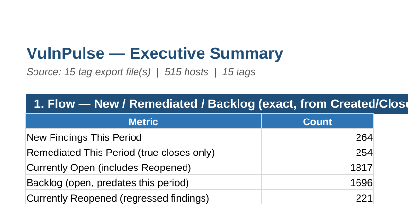
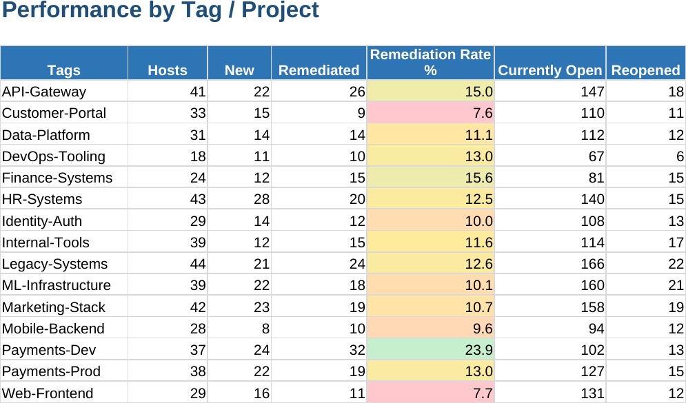

# VulnPulse

**Automated executive vulnerability management reporting for CrowdStrike Falcon, across multiple projects/teams, with zero manual Excel work.**

Built to solve a real workflow problem: producing a monthly leadership-ready vulnerability report across 10 CrowdStrike-tracked projects, where the data was too large to export as a single file and had to be pulled per-project instead.



## The problem

Manually building a vulnerability posture report every month — for one project — usually means: exporting from the console, pasting into Excel, manually diffing against last month's numbers, building pivot tables, and re-formatting charts. Across 10 projects, that's not a monthly task anymore, it's most of a week.

Worse, most manual versions of this get the metrics subtly wrong:
- "New" and "Remediated" get estimated from comparing two point-in-time snapshots, which hides findings that opened *and* closed within the same window
- Mean-time-to-remediate gets approximated instead of calculated from real close dates
- A vulnerability that was fixed and later **regressed** (reopened) quietly gets counted as a win, because most ad-hoc spreadsheets don't distinguish it from a fresh remediation

## What VulnPulse does

Given a folder of per-project CrowdStrike exports (any number — this doesn't assume exactly 10), one command produces a single, formula-driven Excel workbook:

- **Exec Summary** — new/remediated/backlog flow, true MTTR by severity, SLA compliance %, with charts
- **Tag Leaderboard** — every project ranked by remediation rate, with regressions (reopened findings) tracked as their own signal, not hidden inside "open" counts
- **Aging Analysis** — how long currently-open findings have been sitting, bucketed
- **Top Risks** — highest-risk hosts and most-recurring CVEs across the fleet
- **All_Findings_Raw** — the full dataset, with every downstream metric computed as a live Excel formula referencing it



```bash
python3 vulnpulse.py \
  --input-dir sample_data \
  --period-start 2026-07-01 \
  --period-end 2026-07-31 \
  --out-dir sample_output
```

## Design decisions (and why)

**Every number is a live Excel formula, not a hardcoded value.**
The workbook's `All_Findings_Raw` sheet holds the data; every other sheet uses `COUNTIFS`/`SUMIFS`/`AVERAGEIFS` to compute from it. Change the reporting period in two cells, or edit a row of data, and the whole report recalculates. This also means anyone reviewing the report can click a summary number and see exactly what it's counting — no hidden pandas logic to trust blindly.

**Reopened findings are not remediations.**
A finding that was closed and later reopened represents a *failed* fix, not a successful one. Early versions of this counted any finding with a Closed Date in the period as "remediated" — which meant a regression could inflate the remediation numbers. The final logic requires `Status = Closed` (not Reopened) **and** a Closed Date in range, and reopened findings are tracked as a distinct regression metric per team.

**The input format is per-tag files, not one combined export, because that's the real constraint.**
CrowdStrike's export has practical size limits, so pulling one combined file across projects isn't always possible. Rather than working around that with a brittle assumption, the script takes a directory of any number of per-tag files and infers the tag from either a `Tags` column or the filename — so the number of projects can grow or shrink without touching the code.

**Business context (asset criticality, ownership, exposure) needed to come from the export itself, not a separate spreadsheet join.**
An earlier iteration of this maintained a manually-updated CSV mapping hostnames to criticality tiers — a classic source of silent drift as infrastructure changes. Once it became clear CrowdStrike's detailed export already includes `Asset Criticality` and `Tags`, the separate mapping step was removed entirely.

## Setup

```bash
pip install -r requirements.txt
```

Tested on Python 3.10+, including Ubuntu under WSL2.

## Input format

Each file in `--input-dir` should be a CrowdStrike Falcon detailed vulnerability export (CSV or XLSX) containing **both open and closed findings** — not just what's currently open, since New/Remediated calculations depend on historical Created/Closed dates.

Required columns:
```
Hostname, HostType, OSVersion, Product, CVE ID, Status, Severity,
Created Date, Closed Date, Base Score, Tags, Asset Criticality,
Vulnerability ID, Recommended Remediations
```

If a file has no `Tags` column, the filename (minus extension) is used as the tag/project name.

## Sample data

`sample_data/` contains fully synthetic example exports (15 teams/projects, ~3,800 findings across 515 hosts) — safe to explore or run the script against directly. `sample_output/` has a report already generated from that data if you just want to look at the result.

## Adjusting SLA targets

Defaults: Critical = 15 days, High = 30, Medium = 90, Low = 180 — edit `SLA_DAYS` near the top of `vulnpulse.py`, or edit the small lookup table directly in the generated workbook (`All_Findings_Raw`, columns AA:AB).

## License

MIT — see [LICENSE](LICENSE).
